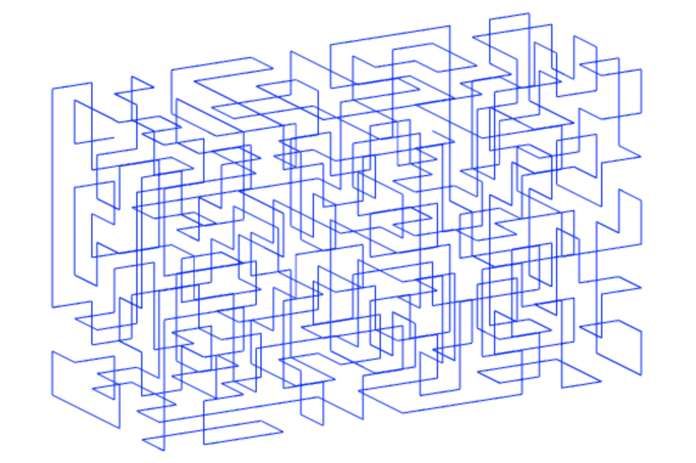

HamPath3
=======

A library for generating random-looking Hamiltonian paths (aka self-avoiding walks) on a 3D grid. For Hamilatonian paths on a 2D grid, see the library this was based on: https://github.com/oysterCrusher/hampath.



Use
---

To generate a 3D Hamiltonian path object:

```javascript
import { hampath3 } from 'hampath3';
const path = hampath3({ 
    width: 12, // Optional. Width of the grid (Default: 4)
    height: 12, // Optional. Height of the grid (Default: 4)
    depth: 12, // Optional. Depth of the grid (Default: 4)
    seed: "12345678" // Optional. Passing a seed will always produce the same pseudorandom result.
}); 
```

The `path` object generated has the form:
 
```javascript
path = {
    start : [1, 3, 1], // Coordinates of the start of the path
    end : [2, 6, 4], // Coordinates of the end of the path
    data : [[1, 3, 1], ... [2, 6, 4]] // Sequence of nodes along the path
}
```

License
-------

[WTFPL](http://www.wtfpl.net/)